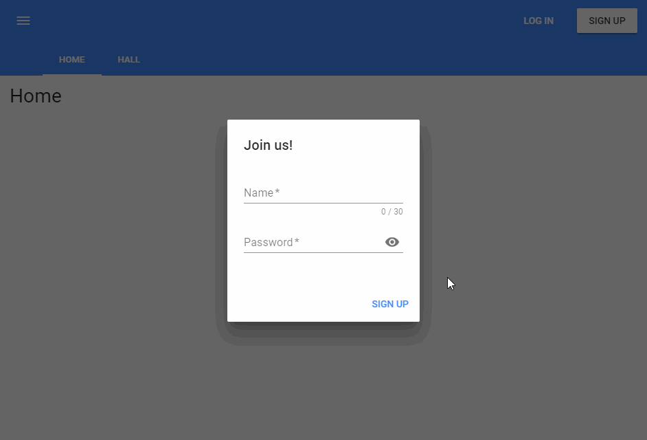

# nodejs-practice
This is a practice for Nodejs study, it implemented a little chat room and user login system.

Mainly used libs:
* vue-cli
* vue-material
* vue-socket.io
* koa2
* jwt-decode
* socket-io

### Install & Run
```
git clone https://github.com/arkceajin/nodejs-practice.git

// Run vue-cli
cd nodejs-practice
npm install
npm run dev 

// Run koa server & socket-io server
cd server
node app.js 

```
Enter `localhost:8080` into the browser to view the demo. 

### Demo

